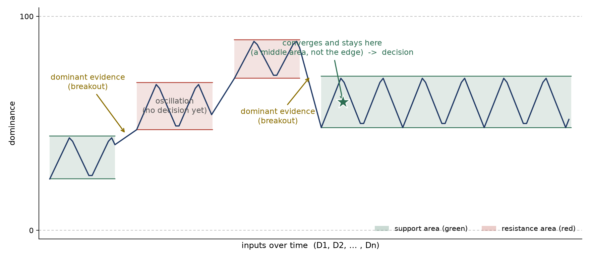

# CCR V1.1 — Node Behavior Simulator

This is an abstract oracle that simulates the **behavior** of a CCR V1.1 node:
**both the pre-processing (relevance) filter and the aggregation function**. It does
**not** implement a specific aggregation function. It is meant to show the team exactly
what a V1.1 node should do, so the flow can be implemented.

## What CCR V1.1 adds

V1.1 has two blocks inside each node:

1. **Pre-processing filter (relevance).** For each received input it marks it relevant
   (1) or not (0) and passes only the relevant ones to aggregation. Here it is a simple
   per-input random keep/drop.
2. **Aggregation function** (it replaces the V1.0 dummy).

The simulator in this repo models **both** blocks: the pre-processing filter and the
aggregation function.

### Data flow inside a node

```
n inputs (D1 ... Dn)  ->  pre-processing filter (relevant 1 / not 0)  ->  aggregation function  ->  output
   from other nodes         only a subset passes                          (this simulator)          decision / no decision
```

The node's own belief goes straight to the aggregation function.

## What the graph shows

Two example runs. Convergence can happen in **any** area, not only at the edges (only a trajectory that keeps oscillating and never settles gives no decision):




As the (filtered) inputs arrive, the **decision trajectory** moves like a price chart:

- **dominance** on the y-axis, bounded to **0 to 100**.
- **support and resistance areas** (the shaded phases); the trajectory oscillates inside a
  phase and **breaks out** to another level when there is enough dominant evidence.
- **Convergence** is the output: if the trajectory settles in a support or resistance area
  and stays there, that is a **decision** (marked on the graph with a star and the point of
  convergence). If it keeps oscillating, the output is **no decision**.

### How a phase ends (breakout)

A phase is an area where the trajectory oscillates inside one support (green) or resistance
(red) area. A phase ends only when there is **enough dominant evidence** to break out of it.
The phase holds while the input dominance stays below a breakout threshold, so inputs below
the threshold keep the trajectory oscillating in the phase. It takes a **dominant input**
(strong evidence) to break out to the next area. The stronger the dominant evidence, the
sooner the phase ends.

- **Support (green):** an area that acts as a floor. The trajectory falls into it and
  oscillates on top of it; breaking below needs enough dominant evidence.
- **Resistance (red):** an area that acts as a ceiling. The trajectory rises into it and
  oscillates beneath it; breaking above needs enough dominant evidence.

### The output (V1.1 rule)

Binary only:

- **converge to a support or resistance area and stay -> decision**
- **keep oscillating (no convergence) -> no decision**

It is only "decision or no decision" in V1.1 (not which decision, not goal based).

## Install

```bash
python3 -m venv venv
source venv/bin/activate
pip install -r requirements.txt
```

## Run

```bash
python run_sim_interactive.py   # 4 random interactive charts (HTML), opens in the browser
python run_sim.py               # 4 random static charts (PNG) in outputs/
```

Each run is fully random (unpredictable behavior), so different runs give different phases,
different filter pass-rates, and decision or no decision.

## Files

- `aggregation_behavior_sim.py` — the core: `make_inputs(...)` (synthetic inputs with the
  relevance filter) and `simulate(...)` (the behavior + the decision / no-decision output).
- `run_sim_interactive.py` — interactive charts (Plotly), hover for input, dominance, phase,
  filter status, breakout, and the convergence / output.
- `run_sim.py` — static charts (matplotlib).

Outputs are written to `outputs/` (git-ignored).
