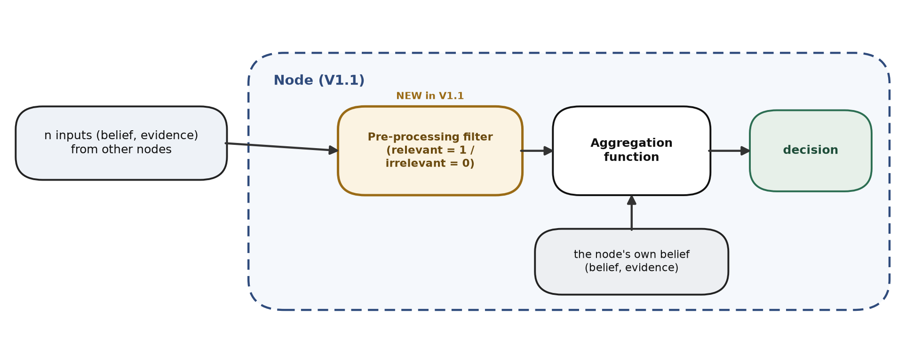
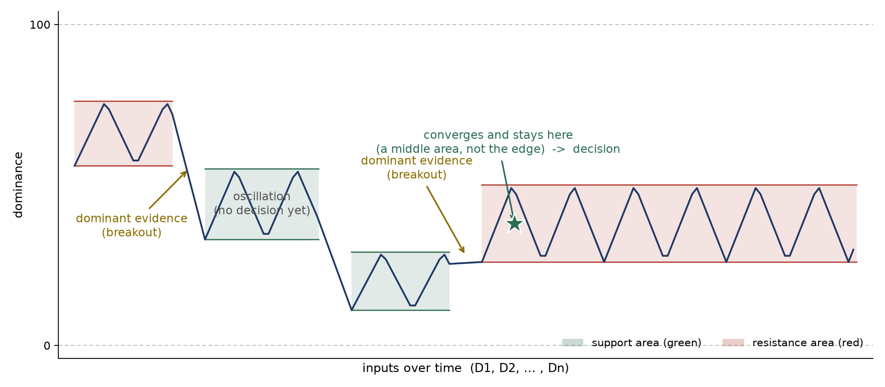

# CCR V1.1: Pre-processing filter & Aggregation function Behavior Simulator

An abstract oracle that simulates the **behavior** of a CCR V1.1 node: both the
pre-processing (relevance) filter and the aggregation function. It does **not** implement
a specific aggregation function. It shows the team exactly what a V1.1 node should do, so
the flow can be implemented.

## Scope of V1.1

- Builds on V1.0; V1.1 inserts the pre-processing filter before the aggregation function.
- Model the pre-processing filter and the aggregation function behavior in a simulator
  (replacing the V1.0 dummy).
- The pre-processing box is a simple relevance filter (relevant = 1 / irrelevant = 0).
- The aggregation function outputs a binary result in the simulator: decision or no
  decision, decided by convergence (converges = decision, keeps oscillating = no decision).
- Each node has its own unique pre-processing filter and aggregation function.

## Data flow inside a node & Output



The node receives n inputs (D1 ... Dn) from the other nodes. The pre-processing filter
marks each input relevant (1) or not (0) and passes only the relevant ones, so only a
subset of the n reaches the aggregation function. The aggregation function receives this
data and produces the binary output: a decision or no decision, converges = decision,
keeps oscillating = no decision.

## Pre-processing filter & Aggregation-function behavior simulator

The simulator models the pre-processing filter and the aggregation function and outputs a
decision. The pre-processing filter is applied on the inputs (each input is randomly kept
or dropped, for example about 55 percent of the input pass). The aggregation function
behavior is modeled in the simulator, where it shows the dominance trajectory. Its output
is binary: a decision when the trajectory converges, or no decision when it keeps
oscillating.




## Resistance & Support

- **Support (green):** an area that acts as a floor. The trajectory falls into it and
  oscillates on top of it; breaking needs enough dominant evidence.
- **Resistance (red):** an area that acts as a ceiling. The trajectory rises into it and
  oscillates beneath it; breaking needs enough dominant evidence.

## Install

```bash
python3 -m venv venv
source venv/bin/activate
pip install -r requirements.txt
```

## Run

```bash
python run_sim_interactive.py   # 4 random interactive charts (HTML), opens in the browser
```

Each run is fully random, so different runs give different phases, different filter
pass-rates, and decision or no decision.

## Files

- `aggregation_behavior_sim.py` — the core: `make_inputs(...)` (synthetic inputs with the
  relevance filter) and `simulate(...)` (the behavior and the decision / no-decision output).
- `run_sim_interactive.py` — the interactive charts (Plotly): hover for input, dominance,
  phase, filter status, breakout, and the convergence / output.

Outputs are written to `outputs/` (git-ignored).
